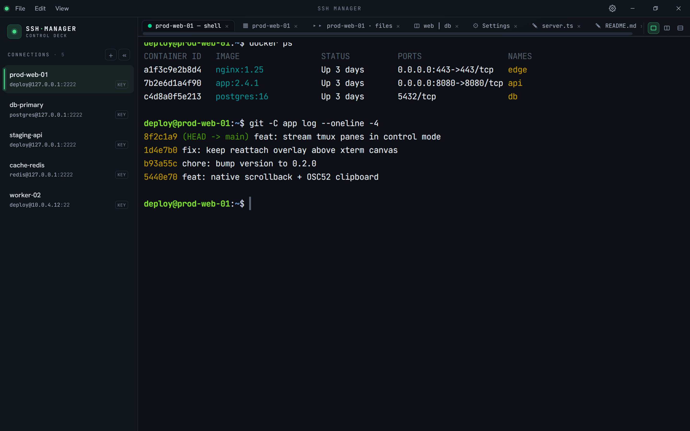
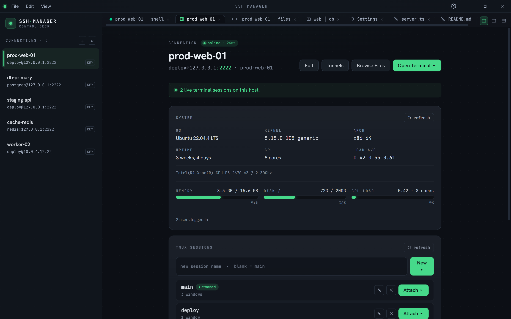
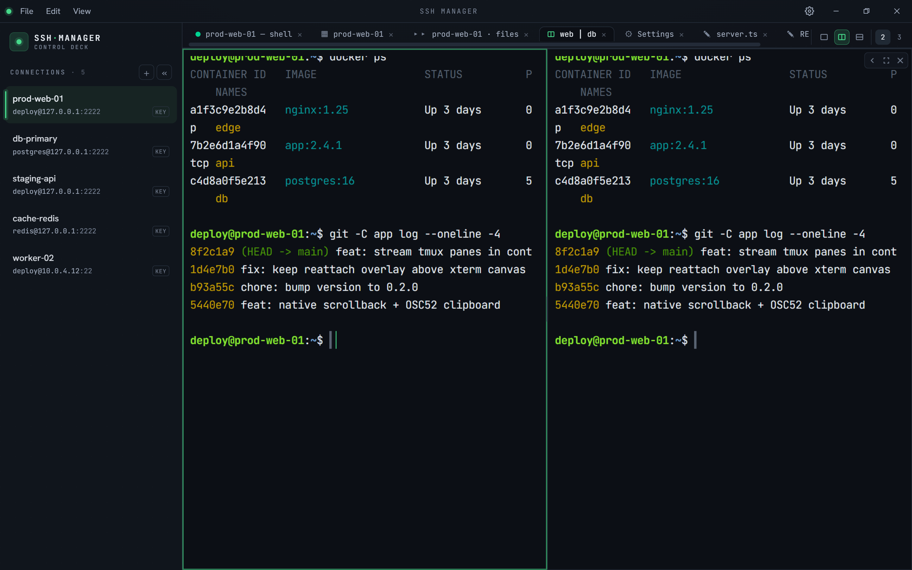
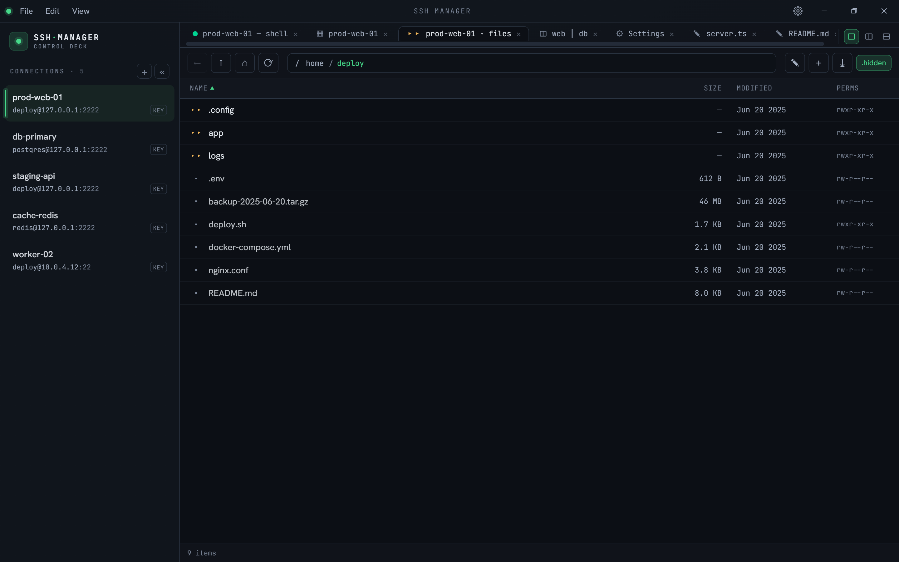
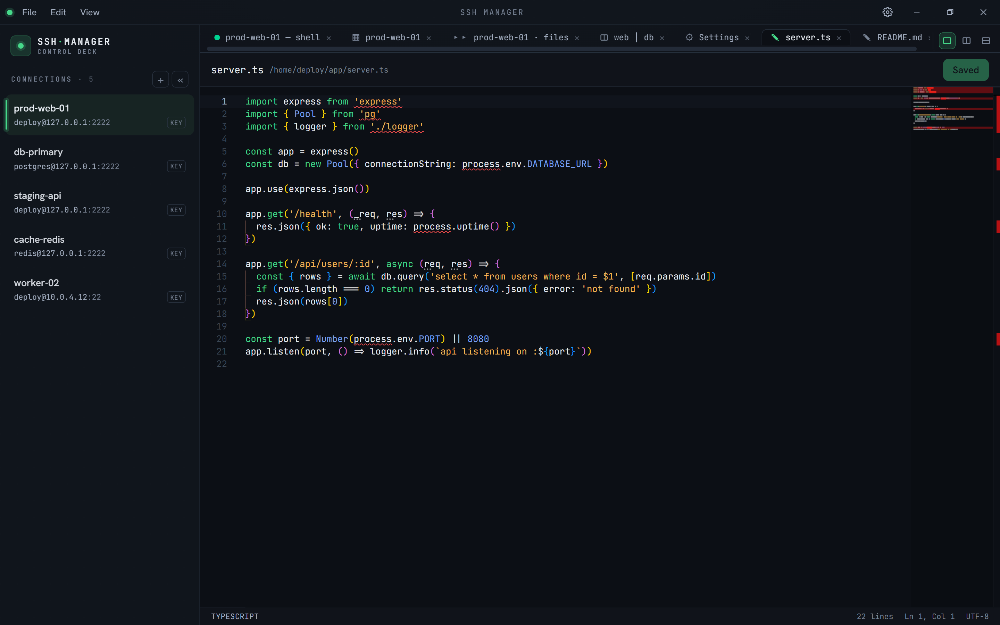
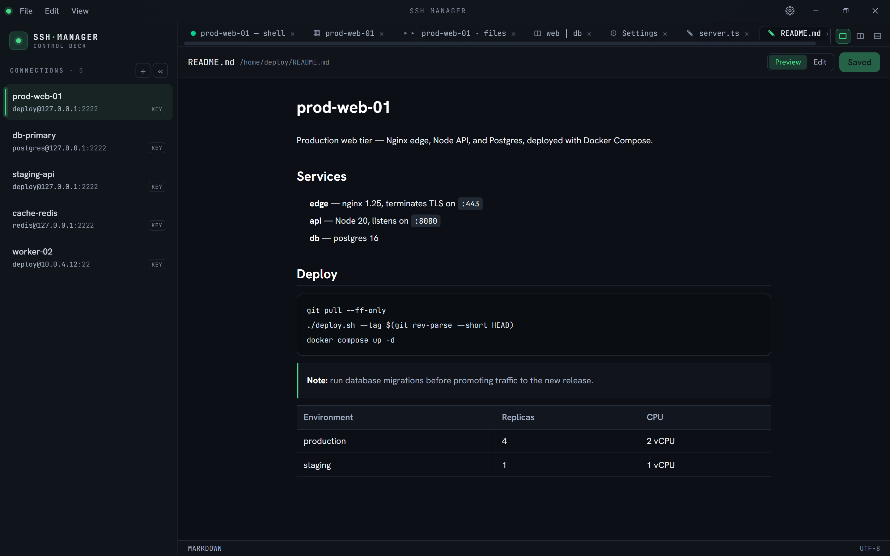
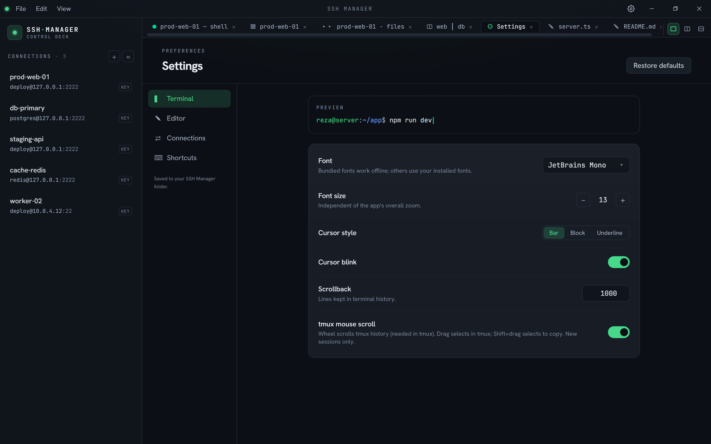
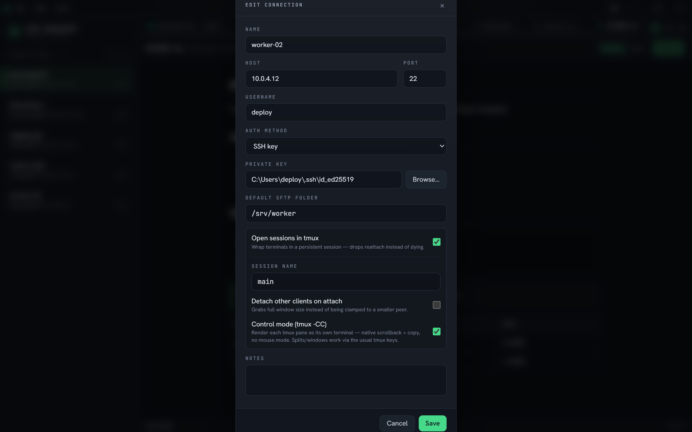

# LT SSH Manager

A cross-platform desktop SSH manager with embedded, full-color terminals.
Built with Electron + React + xterm.js, with all SSH/secret handling isolated
in the main process.

## Screenshots

> The hosts and data shown are from a throwaway local demo server.



| | |
| :---: | :---: |
| **Server dashboard** — host vitals + tmux sessions | **Split panes** — tile sessions in one tab |
|  |  |
| **SFTP file manager** | **Remote code editor** (Monaco) |
|  |  |
| **Markdown preview** | **Settings** |
|  |  |
| **Connection manager** — key / password / agent + tmux | |
|  | |

## Features

- **Embedded terminals** — real interactive shells rendered with xterm.js
  (WebGL), so `htop`, `vim`, `docker stats`, `tail -f` all work and look right.
- **Multiple sessions** in tabs, each with a live connection-status indicator.
- **tmux control mode** — optional `tmux -CC` integration renders each tmux pane as
  its own native terminal: real scrollback and copy with no mouse-mode, while tmux
  keeps your sessions alive across drops.
- **Connection manager** — add/edit/delete connections; key, password, or agent auth.
- **Server dashboard** — at-a-glance host vitals (OS, kernel, uptime, CPU/memory/disk
  meters, load) from a one-shot probe, plus a tmux session list with one-click attach.
- **SFTP file manager** — browse, upload (incl. drag-and-drop), download with progress,
  rename, chmod, mkdir, and recursive delete over a pooled per-connection channel.
- **Remote file editor** — edit remote files in an embedded Monaco editor, with markdown
  preview and configurable font / size / tab width / word-wrap / minimap settings.
- **Port forwarding / tunnels** — local (`-L`), remote (`-R`), and dynamic SOCKS5 (`-D`)
  tunnels per connection, persisted, with live state and connection counts.
- **Session persistence** — reopens your previous tabs (dashboards, terminals, SFTP,
  editors, tunnels) on launch; tmux sessions re-attach if still alive. Passwords are
  never persisted — they're re-resolved on restore.
- **Encrypted secrets** — passwords stored via Electron `safeStorage`
  (Windows DPAPI / macOS Keychain / Linux libsecret). Never written in plaintext.
- **Host-key verification** — trust-on-first-use with SHA256 fingerprints, and a
  loud warning if a known host's key changes (MITM protection).
- **Resilient connect** — retries transient failures with jittered backoff, but
  fails fast on permanent errors (bad auth, missing key, rejected host key).

## Architecture

| Layer | Location | Responsibility |
| --- | --- | --- |
| Main | `src/main/` | SSH sessions (`ssh2`), host-key store, connection/secret stores, IPC |
| Preload | `src/preload/` | `contextBridge` — exposes a minimal typed `window.api` |
| Renderer | `src/renderer/src/` | React UI: sidebar, dialogs, xterm terminal tabs |
| Shared | `src/shared/` | Types shared across processes |

Security: the renderer runs with `contextIsolation: true`, `nodeIntegration:
false`, and a strict CSP. It never touches Node, the filesystem, or `ssh2`
directly — only the curated `window.api` surface.

Data is stored under the app's userData dir (`%APPDATA%/ssh-manager` on Windows):
`connections.json`, `secrets.json` (encrypted), `known_hosts.json`,
`settings.json`, `workspace.json` (open tabs), and `tunnels.json`.

## Development

```bash
npm install
npm run dev        # launch with hot reload
npm run typecheck  # type-check main + renderer
npm run build      # production build into out/
npm run dist       # build the Windows NSIS installer (release/)
```

> **Note:** on Windows, `electron-builder` may need symlink privileges (it extracts
> bundled tooling that contains symlinks) — run the command from an elevated shell
> once, or enable Developer Mode.

## License

Licensed under the [GNU General Public License v3.0](LICENSE).
